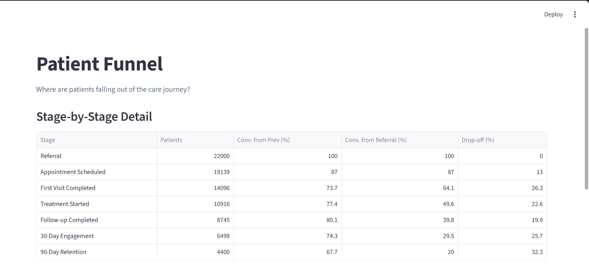
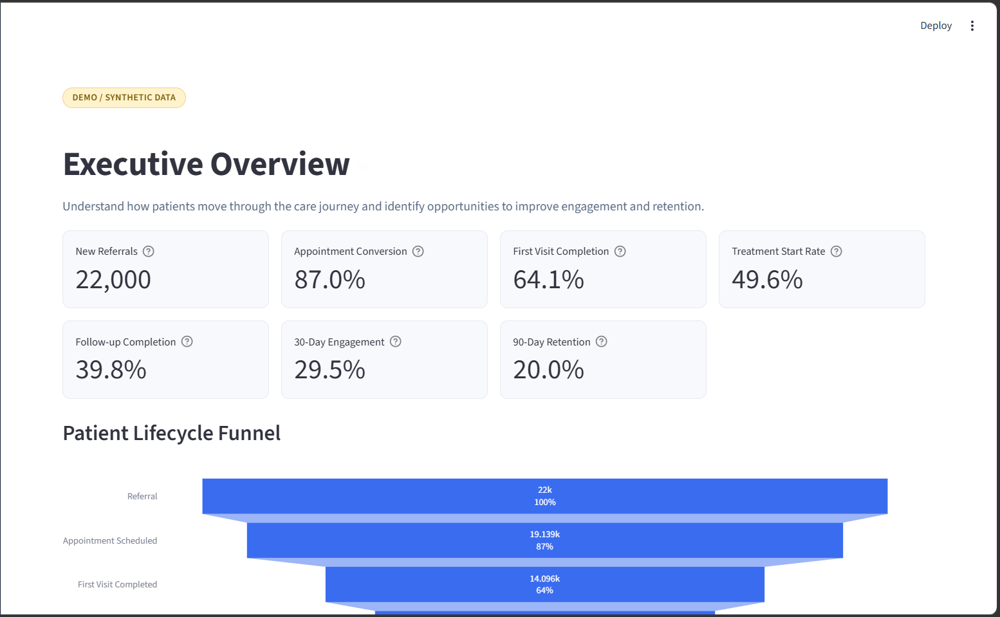

# MSK Patient Journey Intelligence

**Synthetic Healthcare Operations Analytics** — a Streamlit + Python portfolio application
demonstrating product and operational analytics for a modern musculoskeletal (MSK) care
platform.

> **Portfolio Prototype.** This application uses entirely synthetic data. It does not use,
> claim access to, or represent any real patient, provider, clinic, or Flagler Health data.
> It is not a clinical decision-support system.

---

## Problem

MSK (musculoskeletal) care organizations run a multi-stage patient journey — referral,
scheduling, evaluation, treatment, follow-up, and long-term engagement — and patients drop
out at every stage. The central operational question this app answers:

> **Where are patients dropping out of the MSK care journey, what operational factors are
> associated with that drop-off, and what should the organization investigate next?**

This is the kind of ambiguous, high-leverage question a Senior Data Scientist is asked to
turn into a clear, defensible, and actionable analysis.

## Approach

```text
Patient Journey Data
        ↓
Funnel Analysis          → where do patients drop off, and by how much?
        ↓
Cohort Analysis          → how does retention evolve across patient cohorts?
        ↓
Operational Metrics      → what scheduling/operational factors correlate with drop-off?
        ↓
Anomaly Detection        → which metrics moved outside their normal statistical range?
        ↓
Root Cause Investigation → what changed, and which factors are most associated with it?
        ↓
Recommendation           → Finding → Evidence → Implication → Next Step → Measurement
        ↓
Experiment               → a hypothetical, clearly-labeled test to validate the finding
```

Throughout, the app is careful to distinguish **statistical association** from **causation**.
Anomaly and root-cause findings are described as "most strongly associated with," never as
proven causes — a controlled experiment (the last page) would be required to establish causal
impact.

## Application Pages

| Page | Purpose |
|---|---|
| Executive Overview | KPI cards, patient lifecycle funnel, largest drop-off |
| Patient Funnel | Stage-by-stage detail, segmentation by clinic/provider/referral/condition/insurance |
| Cohorts & Retention | Retention heatmap (Week 1–12) by first-visit month, clinic, condition, or referral source |
| Operational Analysis | Wait times, no-show/cancellation rates, delay-vs-outcome scatter plots |
| Anomalies & Root Cause | Rolling-baseline z-score anomaly detection with drill-down root-cause investigation |
| Recommendations | Finding / Evidence / Implication / Next Step / Measurement cards + a hypothetical experiment design |
| Methodology | Full explanation of every definition, method, and limitation |

## Technology

* Python 3.11+
* Streamlit
* Pandas / NumPy
* Plotly
* SciPy 
* Statsmodels
* scikit-learn 

No paid APIs, no proprietary data sources, no cloud databases, no API keys or environment
variables required.

## Project Structure

```text
msk-patient-journey/
│
├── app.py                     # Streamlit application (all 7 pages)
├── requirements.txt
├── README.md
│
├── data/
│   └── synthetic_patients.csv # ~22,000 synthetic patient journeys (generated, cached)
│
├── src/
│   ├── data_generation.py     # Synthetic data generator with realistic, noisy relationships
│   ├── metrics.py              # Funnel counts, KPI summaries, segment analysis
│   ├── analysis.py             # Cohort/retention, operational analysis, statistical helpers
│   ├── anomaly_detection.py    # Rolling-baseline z-score detection + root-cause breakdown
│   └── recommendations.py      # Recommendation cards + hypothetical experiment design
│
└── assets/
```

## Running Locally

```bash
pip install -r requirements.txt
streamlit run app.py
```

The first run generates the synthetic dataset (~22,000 patient journeys) and caches it to
`data/synthetic_patients.csv`. Subsequent runs load the cached file.


## Limitations

* All data is synthetic. Relationships between operational factors and outcomes are
  intentionally realistic and noisy, but they are generator assumptions, not empirical
  findings — they do not represent, and cannot be used to infer, actual patient behavior at
  any real organization.
* Root-cause and correlation findings are **observational**, not experimental. They identify
  statistical associations and candidate explanatory factors, not proven causes.
* The retention heatmap approximates weekly engagement from 30-/90-day activity-intensity
  fields rather than a full event-level interaction log.
* This is a demonstration of analytical workflow and statistical reasoning, not a production
  clinical or operational system.

## Screenshots


